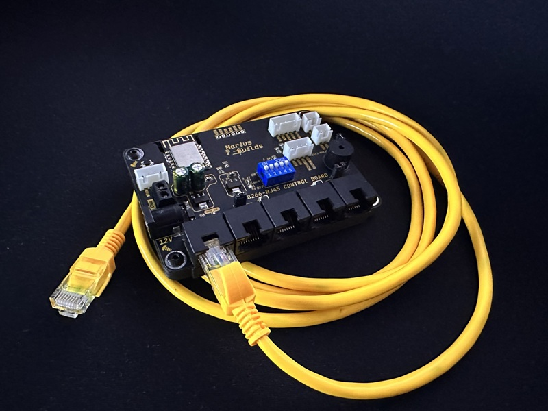
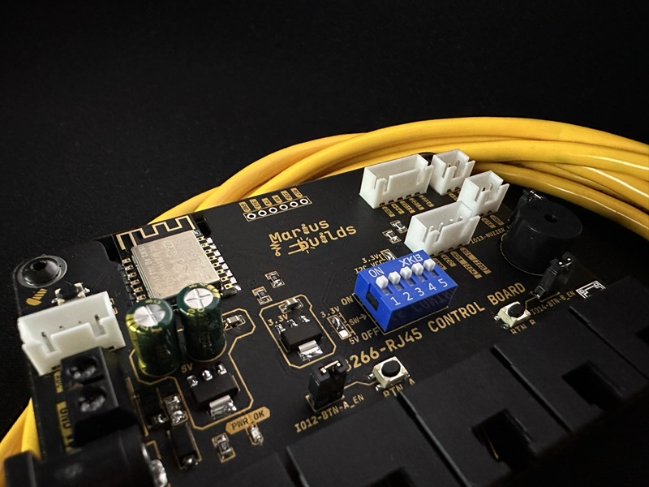
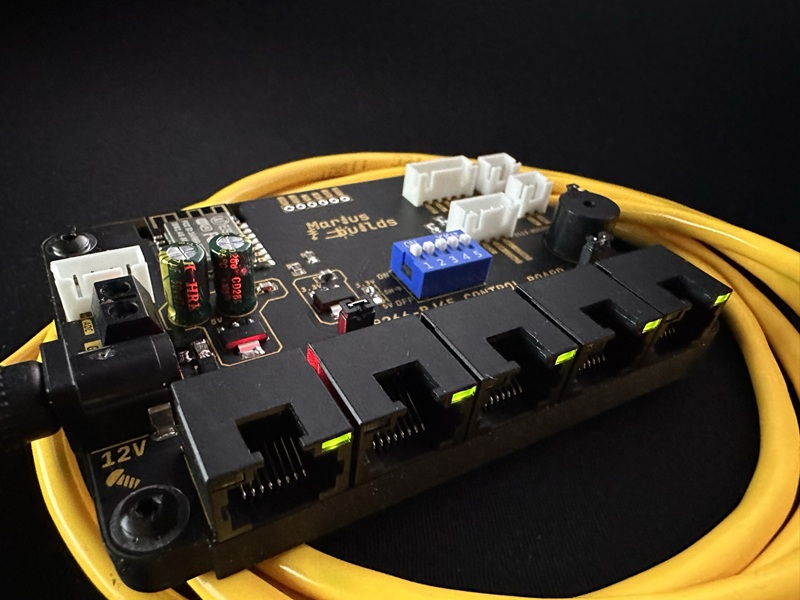
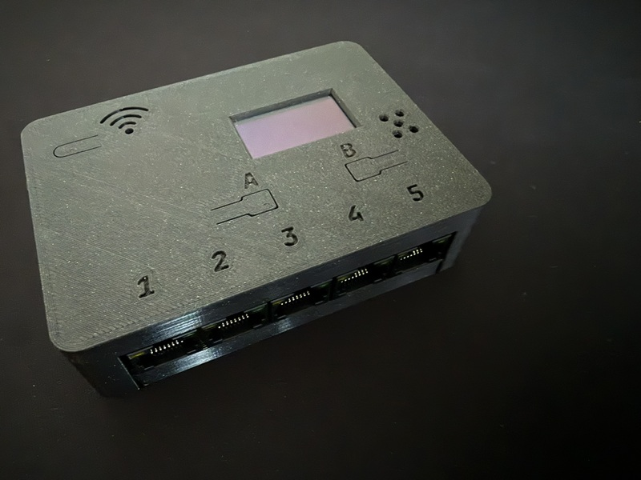
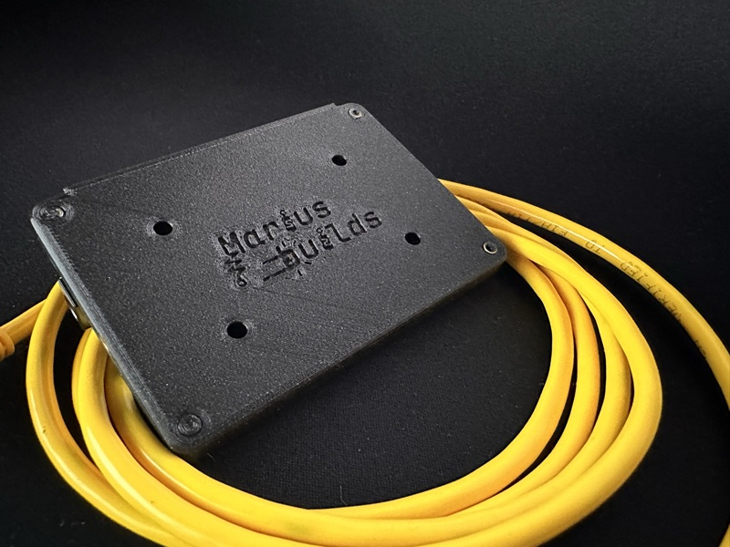
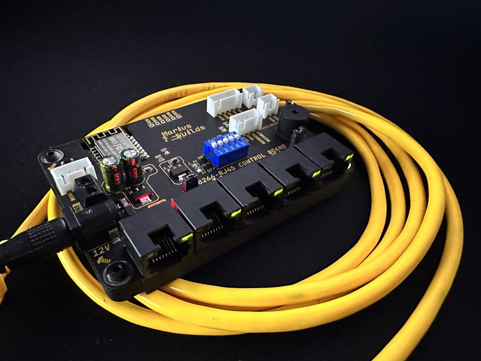

# ESP8266 RJ45 Sensor Board

An ESP8266-powered sensor hub with **five RJ45 ports** for **DS18B20 temperature sensors**, plus an I2C connector for **BMP / BME280 / SHT31** sensors. Your sensors connect with plain network cables, so they can live in the next room, in the greenhouse, or inside the beehive.

  

Why RJ45? Because Ethernet cables are cheap, sturdy, come in every length imaginable, and you probably already have a drawer full of them. Finally, a use for that drawer.

## MAIN FEATURES :

- **ESP-12F (ESP8266)** – Wi-Fi built in, so the board knows what time it is (NTP) and can send your temperatures wherever you want.
- **5x RJ45 ports** for DS18B20 temperature sensors, with built-in port LEDs.
- **I2C connector** for BMP / BME280 / SHT31 and other I2C sensors (and the OLED display).
- **1.3" SH1106 OLED** (128x64, I2C) with a simple menu: temperature for each sensor, clock, Wi-Fi signal bars.
- **Two buttons (A / B)** for navigating the menu, each with an enable jumper (IO12 / IO14) so you can free up the pins if you need them for something else.
- **Buzzer** on IO13, for beeps, startup sounds and (soon) temperature alarms.
- **5-position DIP switch** and a **3.3V / 5V selection jumper** for configuring the sensor side.
- **12V input** through a DC jack or a screw terminal, with reverse-polarity diodes and a resettable fuse.
- **AMS1117-5.0 + AMS1117-3.3** regulators, so everything gets the voltage it likes.
- **Extra connectors**: SPI, 2-pin and 4-pin XH headers, plus a 6-pin programming header.
- **3D-printable case** with a display window, button and port labels.

  
  

## IMPORTANT INFORMATIONS ! ⚠️

1. **Power it from 12V** (DC jack or screw terminal). The onboard regulators take it from there. The 5V regulator is a linear AMS1117, so it gets warm from 12V; that's normal, it just means it's working hard so you don't have to.

2. **There's no USB on this board.** To flash the ESP-12F you need a **USB-to-serial adapter** on the 6-pin programming header. A great match: my [USB-C CH340K Auto-Reset Programmer](https://github.com/mariusmym/USB-C-CH340K-Auto-Reset-Programmer) (shameless self-promotion 😎).

3. **GPIO0 is also the 1-Wire bus** for the DS18B20 sensors. GPIO0 decides whether the ESP boots normally or enters flashing mode, so **if uploading fails, unplug the RJ45 sensors** and try again.

4. **The sensors are numbered by the 1-Wire bus, not by the port.** All DS18B20s share the same bus, so "T1" is the first sensor the bus finds (sorted by its unique address), which isn't necessarily the one on port 1. Plug them in one at a time the first time to figure out who's who, then label your cables. Future you will be grateful.

5. **Put your own Wi-Fi name and password** in the sketch (`YOUR_WIFI_SSID` / `YOUR_WIFI_PASSWORD`) before uploading.

## The firmware 

The sketch in the **SKETCH** folder (v3.3) gives you an OLED menu driven by the two buttons:

| Button | In the menu | Inside an item |
|---|---|---|
| **A** | Scroll to the next item | – |
| **B** | Select | Back |

| Menu item | What it shows |
|---|---|
| **Display T1 … T5** | Temperature from DS18B20 sensor 1 to 5, in big friendly digits |
| **Set Alarm T.** | Temperature alarm setup – *coming soon™* (the function is there, it's just empty for now) |

The main screen also shows the **current time** (synced over NTP, with automatic summer/winter time for Romania – change the `TimeChangeRule`s for your time zone) and **Wi-Fi signal bars**. Every button press gets a beep, and the board says hello with a startup sound.

The BME280 and SHT31 libraries are already included and their objects created, ready for when you connect an I2C sensor. To use one, add `bme.begin(0x76)` (or `sht31.begin(0x44)`) in `setup()` and uncomment the readings in the menu functions.

### Libraries

Install these from the Arduino Library Manager:

- **U8g2** (OLED)
- **OneWire** and **DallasTemperature** (DS18B20)
- **Adafruit BME280** + **Adafruit Unified Sensor**
- **Adafruit SHT31**
- **NTPClient**
- **Timezone** (by Jack Christensen) – it also pulls in **TimeLib**

Board: **Generic ESP8266 Module** or **NodeMCU 1.0 (ESP-12E Module)** from the ESP8266 board package.

### Pinout (from the sketch)

| Function | GPIO |
|---|---|
| DS18B20 1-Wire bus | 0 |
| Button A | 12 |
| Button B | 14 |
| Buzzer | 13 |
| I2C (OLED, sensors) | SDA 4 / SCL 5 |

### Make it yours 

Want MQTT, Home Assistant, a web page, a working temperature alarm, or a beep when the greenhouse gets too cold? Upload the sketch to any AI tool, tell it what you want. It'll hand you back the updated code (hopefully).

## Main components 

| Part | Component | LCSC |
|---|---|---|
| MCU | ESP-12F (ESP8266) | [C89297](https://www.lcsc.com/product-detail/C89297.html) |
| RJ45 jacks (x5) | RCH RC02115 | [C708657](https://www.lcsc.com/product-detail/C708657.html) |
| 5V regulator | AMS1117-5.0 | [C6187](https://www.lcsc.com/product-detail/C6187.html) |
| 3.3V regulator | AMS1117-3.3 | [C2688239](https://www.lcsc.com/product-detail/C2688239.html) |
| Resettable fuse | Bourns MF-NSMF050-2 | [C75464](https://www.lcsc.com/product-detail/C75464.html) |
| DIP switch | XKB DS-05BLP | [C692503](https://www.lcsc.com/product-detail/C692503.html) |
| DC jack | XKB DC-005I-5A-2.5 | [C2689704](https://www.lcsc.com/product-detail/C2689704.html) |
| Screw terminal | KF301-5.0-2P | [C474881](https://www.lcsc.com/product-detail/C474881.html) |
| Buttons (A, B, Reset) | ST-1188 | [C589212](https://www.lcsc.com/product-detail/C589212.html) |

Full BOM in the **GERBER, BOM, PNP** folder.

**Not on LCSC, you'll need:**
- **DS18B20 sensors** (the waterproof probe version is perfect), wired to RJ45 plugs or keystone jacks
- **1.3" SH1106 I2C OLED** (128x64)
- **Optional:** BMP280 / BME280 / SHT31 I2C sensor
- A **12V power supply** and some **Ethernet cables** (check the drawer)

## 3D-printable case 

The case is in the **STL FILES and F3Z** folder, and also on Printables: https://www.printables.com/model/1869994-esp8266-rj45-sensor-board-case

It has a window for the display, labels for the A / B buttons, numbers for the five ports, and holes for the buzzer, so it can beep at you without being muffled.

  
  

## Repository content 

- **GERBER, BOM, PNP** – everything needed to order the PCB from JLCPCB or your favorite fab.
- **SCHEMATIC** – the schematic in PDF.
- **SKETCH** – the Arduino sketch (v3.3) and `graphic.c` (a 64x64 check-mark bitmap for the display).
- **STL FILES and F3Z** – the 3D-printable case, plus the Fusion 360 file.
- **Images** – photos.

## License 

This project is licensed under [Creative Commons Attribution-ShareAlike 4.0 International](https://creativecommons.org/licenses/by-sa/4.0/).

- ✅ **Share** – copy and redistribute it in any medium or format
- ✅ **Adapt** – remix, transform, and build upon it
- 🏷️ **Attribution** – give credit and link back here
- 🔁 **ShareAlike** – if you remix it, share your version under the same license

## Donate ☕

If you'd like to say thanks or buy me a coffee, a **[PayPal donation](https://www.paypal.com/donate/?hosted_button_id=KHR7DYJP2Z8QJ)** is always appreciated!

Have fun and enjoy it ! 😊
